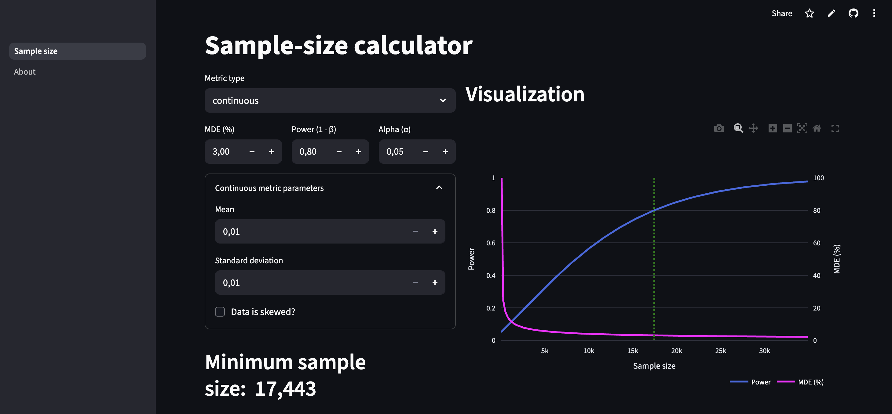

# Sample‑Size Calculator

## Overview



[Open live Streamlit app](https://abcalculator-nmf525vjrygaf9rpyabs39.streamlit.app/calculate_sample_size)


Sample size calculations for A/B tests. 
Supports binary and continuous metrics.
Built with Streamlit, Plotly, and a bit of statsmodels.


## Set up

```bash
pyenv local 3.10
poetry install -E all
```

## Run locally

```bash
make run 
```
or
```python
streamlit run src/frontend/ui.py
```

The app opens at `http://localhost:8501`.

## Development helpers

| Command       | Action                                   |
|---------------|------------------------------------------|
| `make format` | Black + isort auto‑formatter             |
| `make lint`   | flake8, Black, isort, mypy static checks |
| `make test`   | Run unit tests with PyTest               |
| `make run`    | Run app locally                          |


## License

Released under the [MIT License](LICENSE)